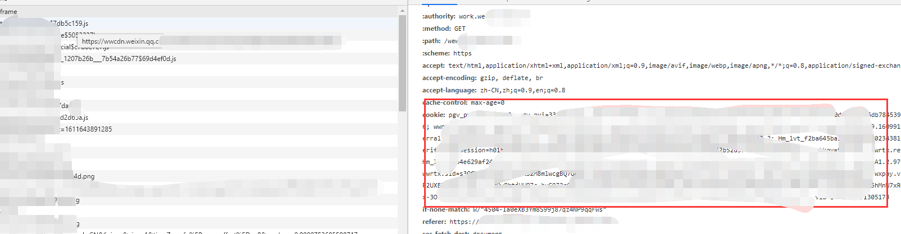
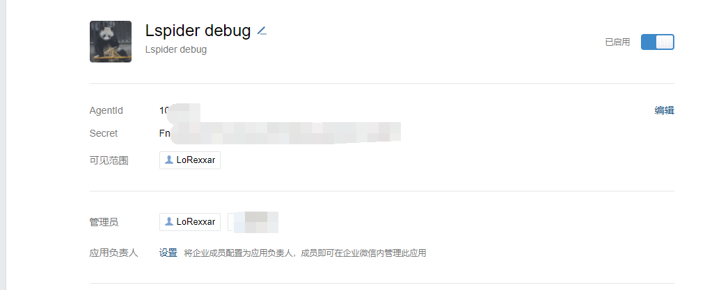
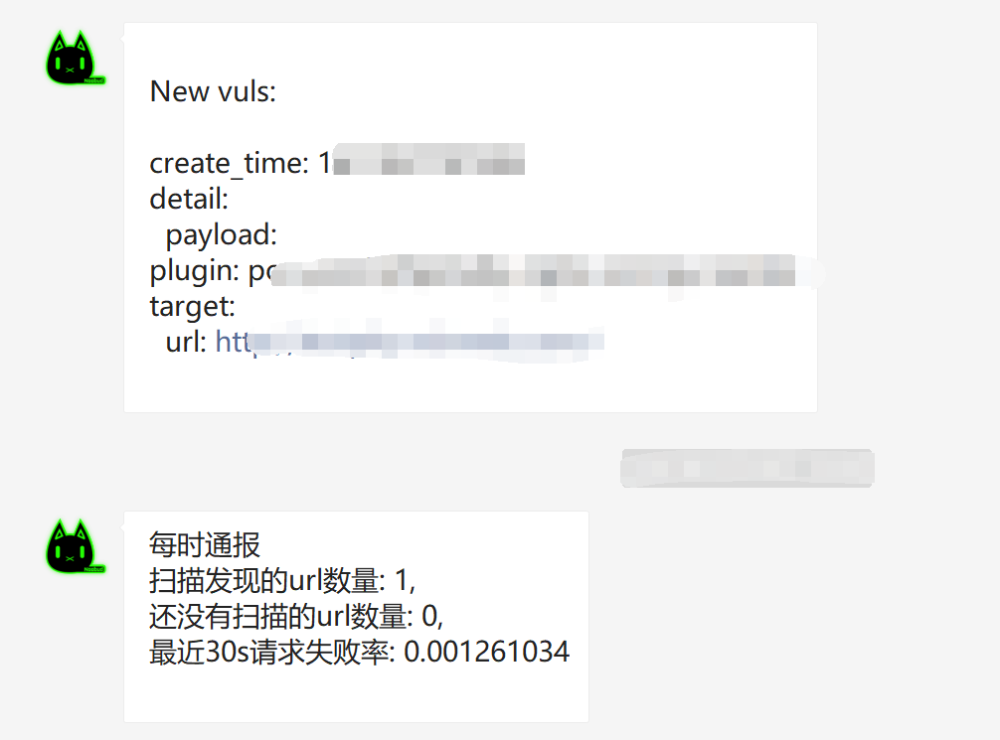

LSpider通过数据库管理工具管理任务，这里以PHPMyadmin做例子

自定义数据库表有
```
index_accountdatatable       目标站点授权账号相关信息
index_banlist                黑名单列表
index_loginpagelist          需要登陆的站点列表
index_scantask               扫描任务列表
spider_scantable             扫描任务时间表
spider_subdomainlist         子域名列表
spider_urltable              扫描结果url表
```

## 如何添加任务

向index_scantask添加数据

```
task_name            必填，任务名
target               必填，任务目标，支持通配符，支持多行输入
target_type          弃用，填link即可
task_tag             选填，任务标签
is_active            必填，1为启用0为关闭
last_scan_time       弃用，随便填即可
cookies              选填，该cookie将会赋值给所有该目标下的请求，包括更深度的爬虫结果
is_finished          为0时启动任务
is_emergency         选填，为1时为紧急线程，将会优先爬取。
```

当添加数据的is_finished字段为0，任务会被启动，并置为1.

## 配置账户信息

当爬虫扫描任务目标的时候，会默认使用cookies字段的cookie来请求。

ps：这里cookie指浏览器请求全量复制即可。


但是如果判断到当前页面仍需要登录(智能登录判断)，则会将目标请求暂时加入rabbitmq紧急队列中，并将链接加入到index_loginpagelist 表中

index_loginpagelist会保留

```
domain: 当前需要登录的域
url: 当前需要登录的url
title: 当前页面的Title
is_active: 当该配置为0时，不再进入rabbitmq任务列表
```

当接收到“获取到新的登陆地址”链接时，你可以通过向index_accountdatatable表添加账户信息来更新验证

index_accountdatatable目前暂时只支持设置cookies来设置鉴权
```
domain: 目标域
cookies: cookie
```

值得注意的是，如果任务没有从index_accountdatatable找到对应自己的域名，则会向父域名寻找替代鉴权cookie（但这种方式并不会影响“获取到新的登陆地址”消息推送）。

也就是说，可能存在登录成功（使用父域名下的cookie）但仍推送需要登录消息

## ban list

通过向index_banlist添加数据可以添加黑名单

```
ban_name: 黑名单条目名
ban_domain: 黑名单
```

这个配置会生效在多个位置，包括任务目标，二次爬取任务目标，爬取结果等...

## subdomain list

spider_subdomainlist是用于储存子域名的表。目前LSpider只内置了一个api用于查询子域名。

当查询到子域名结果的时候，数据将会被加入到该表中，其次，爬虫会将未爬取过的域名加入到任务列表，并将is_finished置为1

```
subdomain: 子域名
title: 第一次请求时会更新获取的title
last_scan: 上一次请求的时间
is_finished: 第一次爬取时会置为1
banner: 后续会添加简单的指纹识别，将banner填写到这里
is_emergency: 是否为紧急任务
```


## 配置webhook

目前的webhook只支持企业微信应用，通过在企业微信上新建应用，



如果希望结果推送和debug信息推送分离，则需要配置两个不同的应用

结果会推送到相应的应用



其中每一小时会推送一次进度播报，如果发现漏洞则会推送简单的漏洞信息。


